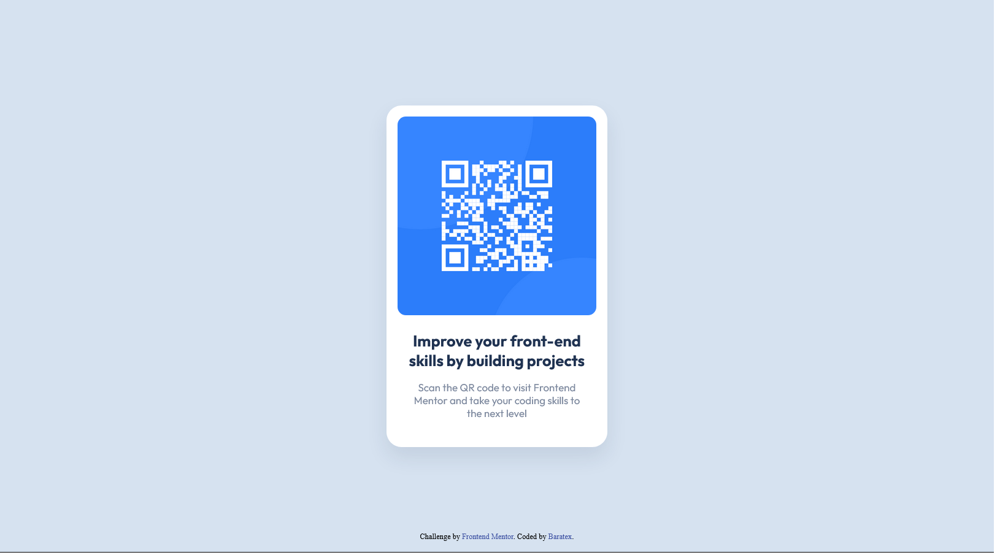

# Frontend Mentor - QR code component solution

This is a solution to the [QR code component challenge on Frontend Mentor](https://www.frontendmentor.io/challenges/qr-code-component-iux_sIO_H). Frontend Mentor challenges help you improve your coding skills by building realistic projects. 

## Table of contents

  - [Overview](#overview)
  - [Screenshot](#screenshot)
  - [Links](#links)
  - [Built with](#built-with)
  - [Author](#author)

**Note: Delete this note and update the table of contents based on what sections you keep.**

## Overview

  Initial challenge from frontendmentor. A very minimalist and neat qr code component and a good start point to continue studying web development.

### Screenshot

### Links

- Solution URL: (https://github.com/baratex/frontendmentor_qr-code)

### Built with

- Semantic HTML5 markup
- CSS custom properties
- Flexbox

## Author

- Website - [Bruno Barato](https://github.com/baratex)
- Frontend Mentor - [@baratex](https://www.frontendmentor.io/profile/baratex)